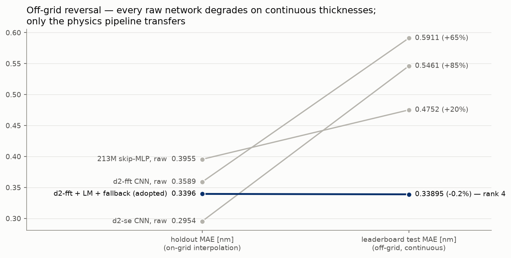

# FringeNet

**Physics-informed deep learning for thin-film thickness metrology**

반사율 스펙트럼(226채널)의 간섭무늬(fringe)로부터 반도체 4층 박막(SiN/SiO₂/SiN/SiO₂ on Si)의
두께를 역산하는 계측 역문제를, 미분가능한 광학 물리 모델(Transfer Matrix Method)을 결합한
딥러닝으로 푼다.

> **도메인 물리를 모델 설계와 추론에 심으면, 1.52M 파라미터 파이프라인이 140배 큰
> 리더보드 1위 모델(213M)의 재현을 넘는다 — 최종 리더보드 test MAE 0.33895 nm (4위).**


- 데이터: [월간 데이콘 — 반도체 박막 두께 분석 경진대회](https://dacon.io/competitions/official/235554/overview/description)
- 키워드: optical metrology, spectral reflectometry, inverse problem, physics-informed ML, differentiable TMM
- 실험별 상세 리포트·수치 정본: **[reports/README.md](reports/README.md)** · 진행 연표: [docs/](docs/)

## 문제

반도체 공정에서 박막 두께의 오차는 곧 수율이고, 양산 라인은 웨이퍼를 자르지 않는
**비파괴 광학 계측**으로 두께를 관리한다 — 백색광 반사 스펙트럼에 두께 정보가
간섭무늬로 인코딩된다. 두께 → 스펙트럼의 순방향은 물리 모델(TMM)로 정확하고 빠르지만,
역방향은 해의 다중성과 국소최소 때문에 어렵다. 이 역방향이 문제다:

- **train**: 두께 4값 + 스펙트럼 226채널, 810,000행 (두께는 10 nm 격자의 전수 조합)
- **test**: 스펙트럼만 10,000행 — **두께가 격자 밖 연속**, 실제 웨이퍼의 조건이다
- 평가지표: 층별 두께 MAE[nm]. 데이터는 대회 페이지에서 받아 `data/raw/`에 배치한다
  (규정상 저장소에 미포함)

## 접근 — 물리와 신경망의 분업

1. **구조 bias** — 스펙트럼을 순서 있는 신호로 읽는 1D CNN (dilated 전 대역 수용영역 +
   물리 범위 출력 bound), 잔차 연결 + 깊이 ×2 + rFFT 분기로 1.52M 백본
   ([level1_cnn](reports/level1_cnn.md) · [task8](reports/task8.md))
2. **물리 디코더** — 파장축·물성이 미지이므로 문헌 분산 법칙(Sellmeier) 기반 자유
   파라미터 7개로 TMM을 캘리브레이션. 물리 단위 테스트 8종(에너지 보존·해석해 대조·
   해석적 야코비안 ↔ autograd)을 통과해야 사용 ([stage_a](reports/stage_a.md))
3. **물리의 자리는 추론이다** — 물리를 학습 손실로 쓰는 통념은 사전등록 ablation에서
   기각됐고([stage_b](reports/stage_b.md)), 대신 **추론 후 보정**으로 쓴다: CNN 예측을
   출발점으로 관측 스펙트럼에 LM 역산 + 라벨 없는 되돌림 규칙
   ([inversion_refine](reports/inversion_refine.md)). **신경망은 해의 다중성(fringe 분지)을
   풀고, 물리는 분지 안의 정밀화를 맡는다.**

## 결과

세 경쟁자를 같은 holdout(81,000행)과 리더보드 test(격자 밖 연속 두께)에서 비교한다.
수치 정본: [task8_judge.md](reports/task8_judge.md) ·
[leaderboard.json](reports/leaderboard.json) · [task8_bench.md](reports/task8_bench.md).

| | 파라미터 | holdout MAE [nm] | test MAE [nm] (격자 밖) | 전이 |
|---|---|---|---|---|
| 213M skip-MLP 단독 (1위 재현) | 213.2M | 0.3955 | 0.4752 | +20% |
| 경량 CNN 단독 (d2-fft) | 1.52M | 0.3589 | 0.5911 | +65% |
| **경량 CNN + 물리 보정 (채택)** | **1.52M** | **0.3396** | **0.33895 (4위)** | **−0.2%** |

**핵심 발견 — 격자 밖 반전.** raw 신경망은 213M을 포함해 셋 전부 test에서 붕괴했고
(+20~85%), 물리 파이프라인만 열화 없이 전이됐다. holdout의 raw 우위는 계측 성능이
아니라 격자 보간 인공물이었다 — **물리 결합의 값어치는 정밀도가 아니라 실전 조건(분포
이동)에 대한 강건성이다.** 이 붕괴는 제출 전에 라벨 없이 검출됐다: 예측을 물리로 되비춘
재구성 잔차가 신뢰도 지표가 된다(계측 이상 감지 관점, [task8.md](reports/task8.md)).



자원 비용까지 보면 ([task8_bench.md](reports/task8_bench.md) 실측): 파라미터 **140배** ·
체크포인트 133배 · 학습 3.7배 작거나 빠르고, 추론은 LM 역산을 포함해도 동급 수준이다
(CPU 1.42배 · L4 1.49배 — CNN forward 단독은 213M보다 빠르다).

**한계** — 물리 디코더의 계통오차(사전 선언한 게이트 중 유계 노이즈 위반율 미통과,
9.99%)가 보정 정확도의 바닥을 만들고, 물성 모델 개선이 남은 레버다. 수직입사·거칠기
없음 등 이상화 가정을 쓴다. 평가가 시뮬레이션 격자의 함정(스냅·클리핑 누설)에 오염되지
않도록 통제한 규약과 함께 [reports/](reports/README.md)에 기록돼 있다.

## 저장소 구조

```
├── src/
│   ├── physics/          # 미분가능 TMM + 해석적 야코비안 · LM 역산 · 분산 모델 · 문헌 광학상수
│   ├── models/           # 1D CNN(채택 백본) · MLP · ConvNeXt · 213M skip-MLP 재현
│   ├── calibrate.py      # Stage A — TMM 캘리브레이션 (물리 제약 최소제곱)
│   ├── train.py / train_gpu.py   # 학습 (CPU 경로 / Colab GPU 경로, resume + Drive 미러)
│   └── evaluate.py       # holdout 재평가 · 제출 생성 (--refine = 물리 보정 경로)
├── tests/                # 물리 단위 테스트 8종 + 역산·로더·모델·학습 계약
├── scripts/              # 전부 산출물 생성기 — 모든 리포트 수치의 재현 경로
├── configs/              # 실험 설정 (<실험>/<변형>.yaml)
├── runs/                 # 실행 산출물 (metrics.json · train.log — 체크포인트는 Drive 미러)
├── reports/              # 실험 리포트 + 산출 정본 + 그림 (인덱스: reports/README.md)
├── notebooks/            # Colab 실행 로그 (라운드별 불변 보존)
└── docs/                 # 주차별 실험 노트 (진행·발견·결정)
```

## 시작하기

```bash
pip install -r requirements.txt        # Python >= 3.11, PyTorch >= 2.x

pytest -q                              # 물리 단위 테스트 포함 전체 테스트
python scripts/verify_data.py          # 데이터 계약 검증 (data/raw/ 배치 후)
python -m src.train --config configs/mlp_baseline/dropout0.0.yaml   # baseline (CPU)

# 최종 제출 경로 — 채택 모델 + 물리 보정(LM 역산 + 되돌림)까지 한 줄
python -m src.evaluate --run runs/task8/d2-fft --submission --refine
```

GPU 학습은 Colab 노트북(`notebooks/`) Run-All로 돌린다. 체크포인트 복구는
[runs/CHECKPOINTS.md](runs/CHECKPOINTS.md), 메모리 요구는 Stage A 경로 최대 약 5 GB.

## 참고자료

H. A. Macleod, *Thin-Film Optical Filters* · M. Born & E. Wolf, *Principles of Optics* ·
[refractiveindex.info](https://refractiveindex.info) (Si/SiO₂/Si₃N₄ 분산 데이터)

## 라이선스

코드는 MIT. 데이터는 포함하지 않으며 데이콘 대회 규정을 따른다.
