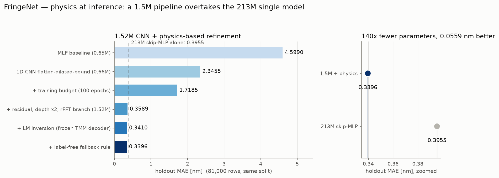

# FringeNet

**Physics-informed deep learning for thin-film thickness metrology**

반도체 다층 박막 두께 광학 계측 AI — 간섭무늬(fringe)에 인코딩된 두께를 읽는다.

반사율 스펙트럼(226개 파장 채널)으로부터 4층 박막(SiN/SiO₂/SiN/SiO₂ on Si)의 두께를 예측하는
역문제(inverse problem)를, 미분가능한 광학 물리 모델(Transfer Matrix Method, TMM)을
inductive bias로 결합한 딥러닝으로 푼다.

- 데이터: [월간 데이콘 — 반도체 박막 두께 분석 경진대회](https://dacon.io/competitions/official/235554/overview/description)
- 키워드: optical metrology, spectral reflectometry, inverse problem, physics-informed ML, differentiable TMM
- **결과 요약·읽기 순서: [reports/README.md](reports/README.md)** — 진행 비교표와 리포트 인덱스
- 진행 기록: [docs/](docs/) — 주차별 실험 노트 (결과·발견·결정·TODO)



이 문서에는 프로젝트 소개·설계·저장소 구조 등 **바뀌지 않는 내용**만 둔다. 수치와 진행
서사는 [reports/](reports/README.md)와 [docs/](docs/)가 정본이다 (위 그림은 스크립트
산출물이라 수치가 갱신되면 재생성으로 따라온다 — `scripts/make_headline_figure.py`).

---

## 1. 문제 배경

반도체 공정은 웨이퍼 위에 박막을 쌓고(증착), 깎고(식각), 패턴을 새기는 일의 수백 번 반복이다.
특히 3D NAND는 산화막(SiO₂)과 질화막(SiN)을 수십~수백 층 교대로 적층(ON stack)하는데,
층 두께의 오차와 불균일이 누적되면 이후 식각 및 셀 특성에 직접적인 수율 문제로 이어진다.
이 프로젝트의 SiN/SiO₂/SiN/SiO₂/Si(기판) 구조는 그 축소 모형에 해당한다.

양산 라인에서는 웨이퍼를 자르지 않고 두께를 재야 하므로 **비파괴 광학 계측**을 쓴다.
백색광을 쏘면 각 계면에서 부분 반사된 파들이 광경로차(≈ 2nd)에 따라 파장별로 보강·상쇄
간섭을 일으키고, 그 결과 반사율 스펙트럼 R(λ)에 두께 정보가 간섭무늬(fringe)로 인코딩된다.

두께 → 스펙트럼의 **순방향 계산은 TMM으로 정확하고 빠르다.** 병목은 역방향, 즉 측정된
스펙트럼에서 두께를 역산하는 과정이다. 전통적인 라이브러리 피팅은 층이 많아질수록
해의 다중성·국소최소·속도 문제를 겪는다. 본 프로젝트는 신경망으로 역매핑을 암묵적으로
학습(amortized inference)하고, 캘리브레이션한 미분가능 TMM을 물리 디코더로 결합한다.
**결합의 자리가 핵심 발견이다** — 물리를 학습 손실로 쓰는 것은 사전등록 ablation 세 축
전부에서 기각됐고, 같은 동결 디코더를 **추론 후 보정**(LM 역산 + 라벨 없는 되돌림 규칙)으로
쓰면 0.66M 모델이 322배 큰 단일 모델을 넘는다. 역할이 갈린다: **신경망은 해의 다중성
(올바른 fringe 분지)을 풀고, 물리는 그 분지 안의 정밀화를 맡는다** (§3.2).

## 2. 데이터

| 파일 | 내용 |
|---|---|
| `train.csv` | `layer_1`~`layer_4` = 각 층 두께[nm] (타깃) + `0`~`225` = 파장 채널별 반사율 |
| `test.csv` | `0`~`225` 반사율만 제공 |
| `sample_submission.csv` | 제출 양식 (`layer_1`~`layer_4` 예측값) |

- **소자 구조**: 공기 / SiN(layer_1) / SiO₂(layer_2) / SiN(layer_3) / SiO₂(layer_4) / Si 기판
- **평가지표**: 층별 두께의 MAE
- **파장축 비식별화 주의**: 헤더 `0`~`225`는 비식별화된 인덱스로, 실제 파장[nm]이 아니다.
  다만 채널 순서는 연속 스펙트럼으로서 물리적 의미를 가진다(1D conv의 축으로 쓸 수 있다).
- **다운로드**: 대회 페이지에서 규정 동의 후 내려받아 `data/raw/`에 배치한다.
  대회 규정상 데이터는 이 저장소에 포함하지 않는다(`.gitignore` 처리).

### 2.1 검증으로 확정된 사실

`scripts/verify_data.py`(계약 검증)와 `scripts/eda.py`(EDA)의 실제 산출에 근거한다.
유도 과정과 전체 분석은 [reports/eda_notes.md](reports/eda_notes.md),
발견 당시의 기록은 [docs/week_1.md](docs/week_1.md) 참조.

| 사실 | 내용 |
|---|---|
| 두께 격자 | **train만** 각 층 {10, 20, …, 300} nm — 30값 × 4층 = **30⁴ = 810,000행 전수 조합** (중복·결측 없음) |
| **test는 격자 밖** | test 10,000행의 두께는 **격자 위에 있지 않다 — 연속이다.** 라벨이 없어 R에서 역추정했고 독립 두 방법이 일치한다: ① 유계 노이즈 반증(같은 두께라면 `max\|ΔR\| ≤ 2a = 0.0304`인데 train 전수 중 최소가 0.063~0.103), ② 디코더 역해 격자거리 평균 **2.42 nm**(균등 이론 2.5) vs train 0.37 nm |
| 노이즈 | 반사율에 **σ = 0.008658의 가산 노이즈** (균등분포에 가까움, 채널에 균일). 음의 반사율이 값의 0.35%, 행의 46.9%에 등장 — 물리적으로 불가능하므로 노이즈의 증거 |
| 층별 가시성 | 10 nm 변화의 SNR 최소 10.3 — **원리적 사각지대 없음.** 층별 오차 격차는 모델 문제로 해석 |
| 채널별 정보량 | 대역 오른쪽 끝이 왼쪽의 약 3배 (노이즈는 균일하므로 SNR도 3배) |
| fringe | 두께↑ → 무늬 조밀 (정성 확인까지만 — 비식별 파장축에서 정량 법칙은 주장하지 않는다) |

이 사실들이 설계를 두 곳에서 규정한다. **전수 격자** → 무작위 split은 모든 두께 값이
학습에 등장하므로 "조합 보간"만 측정한다(§3.5의 평가 프로토콜이 통제한다). **노이즈 바닥**
→ 완벽한 forward 모델도 재구성 RMSE가 σ 아래로 내려갈 수 없어 §3.2 게이트의 기준(1.2σ)과
§3.5 주입 노이즈의 종류(균등 ±0.015)를 규정한다.

## 3. 방법

### 3.1 Level 1 — 구조·표현 수준 bias (representation-level)

파장축이 비식별화되어 실제 nm 값을 모르더라도, **컬럼 순서가 연속 스펙트럼이라는 구조**는
살아있다. 이 구조를 모델에 심는 것이 첫 번째 bias다.

- **1D CNN** — 226개를 순서 없는 독립 피처로 보는 MLP 대신, 인접 채널의 국소 패턴을
  공유 커널로 읽는다. "간섭무늬는 파장축을 따라 이어지는 국소 진동"이라는 물리 가정의 구조적 주입.
- **다중 스케일 수용영역** — fringe 주기는 두께에 따라 달라진다(두꺼운 층 → 조밀한 무늬).
  커널 크기를 섞거나 dilated conv를 써서 넓은 주기 대역을 함께 본다.
- **출력 bound** — `sigmoid`를 물리 범위 [10, 300] nm로 스케일링해, 물리적으로 불가능한
  예측을 구조적으로 배제한다.
- **ablation** — MLP vs 1D CNN, 단일 vs 다중 스케일, bound on/off로 각 요소의 기여를 분리 측정.

### 3.2 Level 2 — 미분가능 TMM 물리 디코더 (loss-level bias)

수직입사에서 층 j의 위상두께와 특성행렬(Abelès, Macleod 관례):

$$\delta_j=\frac{2\pi n_j d_j}{\lambda},\qquad
M_j=\begin{pmatrix}\cos\delta_j & i\sin\delta_j/n_j\\ i\,n_j\sin\delta_j & \cos\delta_j\end{pmatrix}$$

$$\binom{B}{C}=\Big(\prod_{j=1}^{4}M_j\Big)\binom{1}{n_s},\qquad
r=\frac{n_0B-C}{n_0B+C},\qquad R=|r|^2$$

이 디코더는 예측 $\hat d$를 스펙트럼으로 되비춰 관측과 비교할 수 있게 한다 — 쓰는 자리는
둘을 실험했다. **학습 손실**(Stage B의 cycle-consistency 항, 사전등록 ablation으로 기각)과
**추론 후 보정**(LM 역산 + 되돌림 규칙, 채택 — 프로젝트 최선 수치를 만든 경로다). 아래
순서대로다. 파장축이 비식별화되어 있으므로 어느 쪽이든 forward 모델의 미지수를 먼저
알아내야 한다 (Stage A).

#### Stage A — 캘리브레이션 (시스템 식별)

학습셋의 (두께, 스펙트럼) 정답 쌍으로 forward 모델의 미지수를 역으로 피팅한다.
**핵심 설계 원칙은 "물리 법칙을 자유도 개수로 강제한다"** — 물성은 λ의 매끈한 함수이고
파장축은 격자 분산의 결과이므로, 채널별 자유 곡선을 두면 모델 오차가 물성값으로
흡수되어 재구성 RMSE는 내려가도 나온 곡선은 물성이 아니게 된다. 전체 자유 파라미터는
**1~7개**다.

| 대상 | 모델 | 출처 | 자유 |
|---|---|---|---|
| λ(c) | 1/λ = ν₀(1 + r₁u + r₂u²), u = c/225 | 두께축 주파수 식별 (닫힌형) | 0 또는 3 |
| SiO₂ | Sellmeier 3항 **동결** | Malitson 1965 | **0 (게이지)** |
| SiN | Sellmeier 2항 | Luke et al. 2015 | 1~2 (B₁, C₁) |
| Si 기판 | 실측표 + 에너지축 3차 스플라인 | **Schinke 2015** (대안: Aspnes 1983 / Green 2008) | 0~2 (ΔE, k 스케일) |

- **2단계로 푼다** — ① 두께축 주파수 식별(`src/physics/freq_id.py`): 30⁴ 전수 격자의
  조건부 평균이 두께축에서 f = 2n/λ로 진동하는 성질로 λ를 채널별 닫힌형으로 복원(결정론적)
  ② 신뢰영역 최소제곱(`src/calibrate.py`, scipy TRF). 방법 상세는
  [reports/stage_a.md](reports/stage_a.md).
- **게이지 축퇴 — n과 λ는 동시에 식별되지 않는다.** δ = 2πnd/λ 이므로 n과 λ를 같은 배수로
  스케일해도 스펙트럼이 불변이다. **SiO₂를 문헌값에 고정**하는 것이 그 선언이고, λ의 절대
  스케일은 이 가정에 의존한다 (Si 임계점을 앵커로 쓴 검정은 통과 — reports/stage_a.md).

#### Stage B — 물리 손실 (사전등록 ablation — 기각)

캘리브레이션된 디코더를 **동결**하고 cycle-consistency 항을 학습 손실로 걸었다:

$$\mathcal{L}=\mathrm{MAE}(\hat d, d)+\beta\,\lVert R_{\mathrm{TMM}}(\hat d)-R_{\mathrm{obs}}\rVert_1$$

β ∈ {0, 30, 100, 300}을 세 축(무작위 split · held-out 두께 값 split · 수렴 후 warm start)
에서 대조한 결과 **전 축에서 기각됐다** — val MAE가 β에 단조로 나빠지고, 적합 수준을 맞추면
남는 이득이 0이다. 물리 항은 자기 목적함수(재구성)는 개선하므로 실패는 **정렬**의 문제다 —
관측이 R(d) + ε라 손실 항이 지도 항의 노이즈 낀 대리이고, 게이트 (b)를 못 넘은 디코더의
계통 편향으로 예측을 당긴다. 사전등록한 U자 예측이 어긋난 기록까지
[reports/stage_b.md](reports/stage_b.md)에 있다.

#### 물리의 값어치 — 추론 시 역산 refinement + 되돌림 규칙 (채택)

같은 동결 디코더를 학습이 아니라 **추론 후 보정**으로 쓴다 (`src/physics/invert.py` ·
`scripts/refine_inversion.py`): CNN 예측 $\hat d$를 출발점으로 관측 R에 배치 LM으로
재적합한다 — 라벨도 격자도 쓰지 않으므로 test·실계측에 그대로 적용된다. 격자 중앙에서
출발한 같은 LM은 실패하므로 역할이 갈린다: **CNN은 해의 다중성(올바른 fringe 분지)을 풀고,
물리는 그 분지 안의 정밀화를 맡는다.** 여기에 **라벨 없는 되돌림 규칙**(재구성 잔차가
중앙값 + 5·robust σ를 넘는 행은 보정을 버리고 CNN 예측 사용 — LM은 잘못된 분지 바닥까지
성실하게 내려간다)을 얹은 것이 프로젝트 최선 경로다. 판정·수치의 정본은
[reports/inversion_refine.md](reports/inversion_refine.md)(사전등록 판정)과
[reports/cnn_recipe.md](reports/cnn_recipe.md)(확정 모델·되돌림·제출)이다.

#### 판정 게이트 — 물리 디코더 채택 조건

데이터가 TMM으로 생성되었다는 보장이 없으므로 게이트로 판정한다. **재구성 잔차만 보는
게이트는 계통오차를 파라미터로 흡수하는 유연한 모델을 항상 유리하게 만들므로**,
파라미터의 물리성과 예측력을 함께 본다 (`scripts/diagnose_calibration.py`).

| | 기준 | 성격 |
|---|---|---|
| (a) 재구성 RMSE | < 1.2σ = 1.039×10⁻² (σ = 0.008658, §2.1) — 노이즈가 있어 완벽한 모델도 σ 아래로 못 내려간다. 1.2라는 배수에 유도는 없으므로 **계통오차 √(RMSE²−σ²)를 함께** 1차 지표로 읽는다 | pass/fail |
| (b) **유계 노이즈 위반율** | 노이즈가 \|ε\| ≤ 0.0152로 **유계**임이 확정됐으므로(§2.1), 잔차가 이를 넘는 관측은 통계 없이 모델 오류의 증거. 완벽한 모델은 0% | pass/fail |
| (c) 잔차 백색성 | 두께·채널에 구조 없음 — 단독으로는 판별력이 없다 | 참고 |
| (d) 두께 nm 역해 MAE | 디코더를 LM으로 역해한 층별 오차 — Stage B가 강제할 수 있는 정확도의 상한 | 실용 판단 |
| (e) 채널 홀드아웃 | 피팅에서 뺀 20채널의 R을 예측 — 매끈한 물리 분산만 통과 가능 | 물리성 증명 |
| (f) 파라미터 물리성 | 문헌 범위 내 + 곡선 매끈 + 독립 두 방법(주파수 식별 vs TMM 최소제곱) 일치 | 물리성 증명 |

게이트에 실패하면 데이터가 TMM과 다른 방식으로 생성됐다는 뜻이다 — 지도학습된
d→R forward emulator(NN)를 동결 디코더로 쓰는 fallback으로 전환하고, 그 사실을 기록한다.

> **판정 결과 — (b)는 통과하지 못했고, 그럼에도 TMM을 채택했다.** 사전에 pass/fail로
> 선언했으므로 이 사실을 여기에 적어 둔다: 최선 모델의 위반율이 **9.99%**(완벽한 모델은
> 0%)이므로 **forward 모델은 불완전하다**. fallback으로 가지 않은 근거는 둘이다 —
> ① 잔여 오차가 용도에는 충분히 작다(역해 MAE **0.340 nm** vs 규제 대상 CNN 2.346 nm로
> 7배 여유) ② 지배 성분이 모형이 아니라 **문헌표 불일치**로 측정됐다(세 Si 표의 차이가
> 유계 예산의 70%를 쓴다). NN emulator로 갈아타면 이 잔차는 사라지지만 (e)·(f)를 함께
> 잃으므로 목표에 역행한다. **수용하는 리스크**: 물리 항이 0.34 nm 수준의 계통 편향을
> 가진 기준으로 예측을 당긴다 — Stage B ablation이 이 리스크를 측정했고 실측 손해의
> 방향과 일치한다 ([reports/stage_b.md](reports/stage_b.md) §4).

결과와 한계는 [reports/stage_a.md](reports/stage_a.md).

### 3.3 물리 검증 (forward 모델 단위 테스트)

| 테스트 | 기대 결과 |
|---|---|
| 무층 극한 (d=0) | r = (n₀−n_s)/(n₀+n_s) — 맨 기판 프레넬 반사 회복 |
| 에너지 보존 (무흡수 스택) | R + T = 1, T = 4n₀Re(n_s)/\|n₀B+C\|² |
| λ/4 무반사 | n₁=√(n₀n_s), d=λ/4n₁ → R ≈ 0 |
| Airy 대조 (단층) | 해석해 r=(r₀₁+r₁₂e^{−2iδ})/(1+r₀₁r₁₂e^{−2iδ})와 일치 |
| 미분가능성 | dR/dd가 유한차분과 일치 (autograd 검증) |
| 흡수 기판 | 복소 n_s에서 R<1, NaN/Inf 없음 |
| 층 순서 고정 (비대칭 2층) | 재귀 프레넬 해석해와 일치 — 적층 순서 반전을 검출 (명세 6종이 순서를 고정하지 못해 보강한 7번째) |
| 해석적 야코비안 dR/dd | **autograd와** 일치 (rtol 1e-11, 유한차분은 절단오차가 있어 참조값이 못 된다) + 반환 R은 forward와 비트 동일 + L=1 별도 — 추론 시 LM 역산(§3.2)의 근거 |

### 3.4 부산물 — 계측 신뢰도 지표

추론 시 TMM 재구성 오차가 큰 샘플은 모델이 확신하지 못하는 측정으로 플래깅할 수 있다.
이는 실제 fab의 계측 이상 감지(FDC) 관점과 맞닿아 있으며, 지표는 **라벨을 쓰지 않으므로**
test·실계측에도 그대로 적용된다 — 예측 두께를 동결 디코더로 되비춰 관측과 비교하는 행별
잔차다. 측정은 `scripts/evaluate_axes.py`, 실측 결과(순위상관 · 잔차 십분위별 실제 오차 ·
상위 10% 포착률 · 지표 바닥)는 [reports/cnn_recipe_axes.md](reports/cnn_recipe_axes.md).
같은 잔차가 §3.2 되돌림 규칙의 지목 신호이기도 하다.

### 3.5 평가 프로토콜 (정직성 규약)

학습 데이터가 두께 격자를 전수 조합한 **시뮬레이션 산출물**이라는 점은 평가를 왜곡할 수 있다.
포트폴리오로서 신뢰를 얻으려면 이 함정을 스스로 드러내고 통제하는 편이 낫다.

1. **격자 스냅은 분리 보고 — 단 train/holdout에 한해서다.** train 정답이 10 nm 격자
   위에 있으므로 holdout 예측을 최근접 격자로 반올림하면 MAE가 인위적으로 떨어진다
   (실측: 2.346 → 1.287). 이는 계측 성능이 아니라 **데이터 생성 방식의 누설**이므로
   raw MAE와 분리해 보고한다. **그러나 test는 격자 밖이라(§2.1) 제출에 스냅을 쓰면
   MAE가 약 +1.2 nm 나빠진다** — 완벽한 예측기조차 스냅만으로 2.50 nm를 잃는다.
   즉 같은 후처리가 holdout에서는 누설이고 test에서는 순손실이다.
2. **격자 밖 일반화 — 이미 test가 그 평가셋이다.** 실제 웨이퍼의 두께는 격자 위에
   있지 않고, 이 대회의 test도 그렇다(§2.1). 따라서 합성 없이 **holdout(격자 위 조합
   보간) vs test(격자 밖)** 대비로 직접 측정할 수 있다. 라벨 있는 통제 실험이 필요하면
   캘리브레이션된 forward 모델로 비격자 두께를 합성해 보완한다.
3. **held-out 두께 값 split** — 전수 조합 데이터에서 무작위 split은 모든 두께 값이
   학습에 등장하므로 "조합 보간"만 측정한다. 특정 두께 값 자체를 통째로 빼는 split을
   추가해 진짜 외삽 능력을 본다.
4. **노이즈 강건성** — 실측 스펙트럼에는 shot noise와 광원 드리프트가 있다. 입력에
   노이즈를 주입한 조건에서의 성능 열화를 함께 보고한다. 주입은 데이터와 같은 종류인
   균등 ±0.015가 기본이고(§2.1), 이미 있는 노이즈 위에 더하는 "추가분"임을 명시한다.

> **구현 현황: ①③④는 구현·실측까지 완료됐다.** ① 격자 스냅 분리 보고 `src/evaluate.py` ·
> ③ held-out 두께 값 split `data.holdout_thickness` (전 층에서 값을 빼고 그 값이 든 행을
> 통째로 holdout — Stage B 라운드 2·3이 이 split이다) · ④ 노이즈 강건성
> `scripts/evaluate_axes.py` → [reports/cnn_recipe_axes.md](reports/cnn_recipe_axes.md).
> ②는 test에 라벨이 없어 **리더보드 제출로만** 수치가 나오므로 최종 선택 모델에만 쓴다 —
> 캘리브레이션 forward로 격자 밖을 합성하면 같은 물리로 만든 데이터에서 β>0이 유리해지는
> 순환이라 주 판정에 쓰지 않는다 (제출 전 라벨 없는 확인은 잔차 분포 전이 —
> reports/cnn_recipe.md «제출» 절). Task 4·5·6은 이 프로토콜 없이 종결됐으므로 그
> 리포트들은 **격자 밖 외삽 성능이나 노이즈 강건성을 주장하지 않는다**(random split
> 조합 보간 성능만 보고한다).

### 3.6 가정과 한계

- 수직입사·등방성·평행 평면층·표면 거칠기 없음을 가정한다. 실제 계측은 유한 개구각과
  거칠기 보정을 포함한다.
- 데이터가 TMM으로 생성되었다는 보장은 없다 — §3.2의 판정 게이트로 **검증한 뒤** 진행한다.
- 데이터에 σ = 0.008658의 가산 노이즈가 있다(§2.1). fringe 진폭(행별 스펙트럼 범위 중앙값
  0.809)의 약 1%로 무시할 수 없는 크기이며, 재구성 오차의 하한이 되어 §3.2 게이트의
  기준을 규정한다.

## 4. 저장소 구조

```
.
├── README.md                   # 본 문서 — 소개·설계·구조 (불변 내용만)
├── CLAUDE.md                   # Claude Code 작업 메모리 (계약·테스트 스펙·백로그)
├── requirements.txt
├── docs/                       # 주차별 실험 노트 — 진행·결과·발견·결정·TODO (§6)
│   ├── week_1.md               #   week_1 = 2026-08-08 ~ 08-14 (첫 커밋 기준 7일 단위)
│   └── week_2.md               #   week_2 = 2026-08-15 ~ 08-21
├── configs/                    # 실험 설정 — runs/와 같은 2단 구조 (§6)
│   └── <실험>/
│       └── <변형>.yaml         #   예: mlp_baseline/dropout0.0.yaml
├── notebooks/                  # Colab GPU 드라이버 — 라운드별 1개, 완료 후 실행 로그(코드·출력) 불변
│   └── <대실험>/
│       └── roundN_<내용>.ipynb #   예: level1_cnn/round3_bound.ipynb
├── data/                       # 대회 데이터 — 파일은 git 미포함, 구조만 .gitkeep (§2)
│   ├── raw/                    #   데이콘 원본 (사용자가 직접 배치)
│   └── cache/                  #   parquet 캐시 (최초 실행 시 자동 생성)
├── runs/                       # 실행 산출물 — **텍스트 2종만 git 추적** (§6)
│   ├── CHECKPOINTS.md          #   Drive 미러 목록·sha256·복구 방법 (체크포인트는 Drive 보관)
│   └── <실험>/
│       └── <변형>/             #   train.log · metrics.json (+ stage_a만 model.pt — §6)
├── reports/
│   ├── README.md               # **인덱스** — 진행 비교표·읽기 순서·정본/취합 구분
│   ├── <실험>.md               # 대실험별 취합 리포트 — 판단·서사 (eda_notes ~ cnn_recipe)
│   ├── *_gate.md · *_judge.md · *_axes.md · *_diagnostics.md · *_curves*.md · *_metrics.md
│   │                           # 스크립트 산출 정본 (재실행 시 덮어씀 — 손으로 고치지 않는다)
│   └── figures/                # 산출 그림 (리포트·인덱스가 임베드)
├── scripts/                    # 전부 산출물 생성기 — 리포트 수치의 재현 경로다
│   ├── verify_data.py          # 데이터 계약 검증 (+ --deep: test 격자 밖 반증)
│   ├── eda.py                  # EDA 그림 3종 + 측정값 (reports/eda_metrics.md)
│   ├── measure_noise.py        # 노이즈 σ·유계 상한 측정 (채널축 m차 차분)
│   ├── diagnose_calibration.py # Stage A 게이트 (a)~(f) 진단 + 그림 (§3.2)
│   ├── diagnose_predictions.py # 예측 오차 구조 진단 (level1_cnn_diagnostics.md)
│   ├── evaluate_axes.py        # 평가 축 — 노이즈 강건성(§3.5-4) + 신뢰도 지표(§3.4)
│   ├── refine_inversion.py     # 역산 refinement 판정 (사전등록 2 — inversion_refine.md)
│   ├── judge_recipe.py         # post-LM·분지 실패율·되돌림 판정 (cnn_recipe_judge.md)
│   ├── bench_invert.py         # 역해 LM 추론 비용 벤치 (inversion_bench.md)
│   ├── analyze_stage_b_curves.py  # 적합 수준 맞춘 β 대조 (stage_b_curves*.md)
│   ├── make_headline_figure.py # 헤드라인 그림 — 수치는 산출물에서 읽는다
│   └── check_notebook_regression.py  # 노트북 옛 버퍼 되돌림 탐지 (커밋 전)
├── src/
│   ├── physics/
│   │   ├── tmm.py              #   미분가능 TMM + 해석적 야코비안 — 프로젝트의 물리 코어
│   │   ├── invert.py           #   배치 LM 역산 + 되돌림 규칙 (§3.2 추론 경로의 코어)
│   │   ├── dispersion.py       #   문헌 광학상수 로더·Sellmeier·에너지축 스플라인
│   │   ├── freq_id.py          #   두께축 주파수 식별 — λ축의 닫힌형 복원
│   │   └── literature/         #   refractiveindex.info 원본 파일 (CC0, git 추적)
│   ├── data/dataset.py         # CSV → parquet 캐시 → numpy/torch
│   ├── models/                 # 모델 레지스트리·팩토리 (__init__.py의 build_model)
│   │   ├── mlp.py              #   baseline MLP — 구조 bias 없는 대조군 (Task 4 확정)
│   │   ├── heads.py            #   공용 출력단 (ThicknessBound 등)
│   │   ├── cnn.py              #   Level 1 1D CNN — flatten·dilated·bound 플래그 (Task 5 확정)
│   │   └── winner_skip_mlp.py  #   1등 솔루션 213M skip-MLP 충실 재현 (상한 기준선)
│   ├── utils/
│   │   ├── seed.py             #   시드 고정 유틸
│   │   └── io.py               #   원자적 저장 (calibrate·train_gpu 공용)
│   ├── calibrate.py            # Stage A 캘리브레이션 — 물리 제약 최소제곱 TRF (자유도 1~7)
│   ├── losses.py               # Stage B 물리 손실 — 동결 TMM 디코더 + beta 워밍업 (§3.2)
│   ├── train.py                # baseline/k-fold 학습 — CPU 경로 (물리 손실은 GPU 경로에만)
│   ├── train_gpu.py            # GPU(Colab) 학습 경로 — holdout 전용, resume+Drive 미러, train.physics
│   └── evaluate.py             # holdout 재평가·제출 파일 생성 (--refine = 물리 보정 경로)
└── tests/
    ├── test_tmm.py             # §3.3 물리 단위 테스트 (해석적 야코비안 포함)
    ├── test_invert.py          # LM 역산 — 청크 불변·감쇠 스케일·조기 종료·되돌림 계약
    ├── test_dataset.py         # 로더·split (데이터 없으면 해당 테스트만 skip)
    ├── test_models.py          # 모델 계약(shape)·bound·미분·재현성·팩토리
    ├── test_train.py           # 지표·제출 파일 정렬·LR 스케줄·학습 스모크
    ├── test_train_gpu.py       # GPU 경로 — resume=무중단 동일성·미러 복원·물리 손실 배선
    ├── test_losses.py          # 물리 손실 — 동결 계약·dtype 충실도·beta=0 대조군 동등성·누수
    ├── test_calibrate.py       # Stage A — 파라미터화·분할·주파수 식별 계약
    ├── test_notebooks.py       # 노트북 필수 셀 규약 (PAT·반납·무결성 검증)
    └── test_dispersion_literature.py  # 코드 상수 ↔ literature/*.yml 원본 대조
```

## 5. 시작하기

```bash
# Python >= 3.11 (pyproject.toml). venv 또는 conda 환경 어느 쪽이든 된다.
python -m venv .venv && source .venv/bin/activate
pip install -r requirements.txt

pytest -q                          # 물리 단위 테스트 + 로더·역산·노트북 규약 테스트
python scripts/verify_data.py      # 데이터 계약 검증 (통과 시 종료 코드 0; --deep = 격자 밖 반증)
python scripts/eda.py              # EDA 그림 3종 + 측정값 표
python -m src.train --config configs/mlp_baseline/dropout0.0.yaml  # baseline 학습 (CPU)

# GPU가 필요한 학습(CNN 이후)은 Colab에서 노트북 Run-All로 돌린다:
#   notebooks/<대실험>/roundN_<내용>.ipynb  (예: level1_cnn/round3_bound.ipynb)
# 로컬 CPU 스모크:
python -m src.train_gpu --config configs/level1_cnn/flatten-dilated-bound.yaml \
  --device cpu --subset 20000 --epochs 2 --run-name smoke --no-resume

# 최종 제출 경로 — 확정 모델 + 물리 보정(LM 역산 + 되돌림 규칙)까지 한 줄.
# holdout 확정 수치와 test 보정 제출 csv가 함께 나온다 (체크포인트는 runs/CHECKPOINTS.md 참조).
python -m src.evaluate --run runs/cnn_recipe/budget100 --submission --refine
```

`verify_data.py` 최초 실행은 `train.csv`(1.9 GB)를 파싱해 `data/cache/train.parquet`을
만드느라 약 30초 걸리고, 이후 실행은 캐시를 읽어 3~4초다.

**메모리 요구(실측 최대 상주)**: `verify_data.py`·`eda.py` 약 4 GB, `src.calibrate`·
`diagnose_calibration.py` 약 5 GB — 두께축 주파수 식별의 조건부 평균이 holdout 제외
train 전체(73만 행)를 올리기 때문이다. 8 GB 미만 환경에서는 Stage A 재현이 스왑을 탄다.

## 6. 문서·실험 관리

성능 수치와 진행 서사는 README 프로즈에 두지 않는다 — 예외는 스크립트 산출 그림 임베드와
[reports/README.md](reports/README.md)(진행 비교표·인덱스) 링크뿐이다. 역할 분담은 다음과 같다.

주차 로드맵(3주): Week 1 스캐폴드·TMM·검증·baseline → Week 2 구조 ablation·Stage A·
Stage B·역산 refinement → Week 3 모델·학습 최적화(Task 8)와 문서화 마감(Task 9).
현황은 CLAUDE.md 「작업 백로그」와 [docs/](docs/)의 주차 노트가 정본이다.

| 위치 | 역할 | 갱신 시점 |
|---|---|---|
| [`reports/README.md`](reports/README.md) | **리포트 인덱스** — 진행 비교표·읽기 순서·정본/취합 구분 | 헤드라인 수치가 바뀔 때 |
| [`docs/week_N.md`](docs/) | **주차별 실험 노트** — 날짜별 진행·결과·발견·결정 + TODO 관리 | 작업할 때마다 |
| `reports/<실험>.md` | 대실험별 취합 리포트 — 변형 비교·분석·최종 결론 | 대실험 종료 시 |
| `runs/<실험>/<변형>/` | 실행 산출물 — `train.log`(에폭별 실시간 로그) · `metrics.json`(설정 스냅샷 + 최종 지표) | 학습 실행 시. **체크포인트는 Drive 미러 보관** — 목록·sha256·복구는 [`runs/CHECKPOINTS.md`](runs/CHECKPOINTS.md), 예외로 `runs/stage_a/*/model.pt`만 git 추적(진단 스크립트가 직접 읽는다) |
| `configs/<실험>/<변형>.yaml` | 실험 설정 — `experiment`·`run_name` 키 필수 | 실험 설계 시 |

- 실험은 **대실험(experiment) / 변형(run)** 2단 구조. 변형 이름은 번호가 아니라
  무엇이 다른지 드러나는 서술형으로 짓는다 (예: `dropout0.0`, `layernorm`).
- 실험 노트의 주차는 첫 커밋(2026-08-08) 기준 7일 단위 — week_1 = 08-08~08-14.
- 격자 스냅 등 누설 지표는 주 결과로 쓰지 않고 분리 보고한다 (§3.5).

## 7. 참고자료

- H. A. Macleod, *Thin-Film Optical Filters* — 특성행렬 정식화
- M. Born & E. Wolf, *Principles of Optics* — 다층막 간섭 이론
- [refractiveindex.info](https://refractiveindex.info) — Si / SiO₂ / Si₃N₄ 분산 데이터 (캘리브레이션 초기값)
- [대회 데이터 설명](https://dacon.io/competitions/official/235554/data)

## 라이선스

코드는 MIT. 데이터는 포함하지 않으며 데이콘 대회 규정을 따른다.
