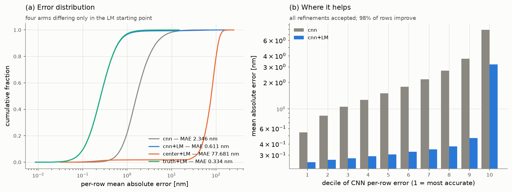

# reports/ — 실험 리포트 인덱스

## 진행 비교표

수치의 정본은 각 행의 리포트다 — 수치가 갱신되면 이 표와 `fig_headline.png`
(`scripts/make_headline_figure.py` 산출)를 함께 갱신한다. 전부 같은 holdout 81,000행,
같은 split(val_frac 0.1, seed 42), 결정론적 추론이다.

| 단계 | holdout MAE [nm] | 정본 |
|---|---|---|
| MLP baseline (0.65M) | 4.5990 | [mlp_baseline.md](mlp_baseline.md) |
| 1D CNN flatten-dilated-bound (0.66M) | 2.3455 | [level1_cnn.md](level1_cnn.md) |
| + 학습 예산 100에폭 (pre-LM) | 1.7185 | [cnn_recipe.md](cnn_recipe.md) |
| + LM 역산 (동결 TMM 디코더) | 0.4884 | [cnn_recipe_judge.md](cnn_recipe_judge.md) |
| **+ 라벨 없는 되돌림 규칙** | **0.3880** | [cnn_recipe_judge.md](cnn_recipe_judge.md) |
| (상한 기준선) 213M skip-MLP 단독 | 0.3955 | [strong_baseline.md](strong_baseline.md) |

최종 파이프라인의 리더보드 제출(test, 격자 밖 연속 두께)은 **MAE 0.38733**이다
(2026-08-18, 15위) — holdout 0.3880이 열화 없이 전이됐다
([cnn_recipe.md](cnn_recipe.md) «리더보드 확정»).

물리 손실(Stage B β)은 사전등록 ablation 세 축 전부에서 **기각**됐다 — 물리의 값어치는
손실이 아니라 추론에 있다는 것이 이 프로젝트의 핵심 결론이다
([stage_b.md](stage_b.md)).

## 읽기 순서 (핵심 서사 7편)

1. [eda_notes.md](eda_notes.md) — 데이터·노이즈 모델 (σ = 0.008658, 유계 |ε| ≤ 0.0152)
2. [level1_cnn.md](level1_cnn.md) — 구조 bias ablation: 어떤 conv가 왜 통하는가 (−49%)
3. [strong_baseline.md](strong_baseline.md) — 상한 기준선: 리더보드 1등 213M 재현
4. [stage_a.md](stage_a.md) — 물리 디코더 캘리브레이션: 자유도 7, 게이트 (b) 미통과 명시
5. [stage_b.md](stage_b.md) — 물리 **손실**의 기각: 사전등록 예측이 어긋난 기록까지
6. [inversion_refine.md](inversion_refine.md) — 반전: 같은 물리를 **추론 후 보정**으로 (−74%)
7. [cnn_recipe.md](cnn_recipe.md) — 학습 예산 + 되돌림 규칙 → **0.3880 nm**, 213M 단독을 넘다

주의 한 가지: [inversion_refine.md](inversion_refine.md)는 30에폭 백본(2.3455 → 0.6110)
기준 **사전등록 2 판정의 정본**이라 재생성하지 않는다 — 확정 모델 `budget100`의
post-LM·되돌림 수치는 [cnn_recipe_judge.md](cnn_recipe_judge.md)가 정본이다
(같은 함수, 다른 run).

## 파일 구분 — 취합(사람) vs 산출 정본(스크립트, 재실행 시 덮어씀)

| 취합 리포트 (판단·서사) | 산출 정본 | 생성 스크립트 |
|---|---|---|
| [eda_notes.md](eda_notes.md) | [eda_metrics.md](eda_metrics.md) | `scripts/eda.py` |
| [mlp_baseline.md](mlp_baseline.md) · [level1_cnn.md](level1_cnn.md) | [level1_cnn_diagnostics.md](level1_cnn_diagnostics.md) | `scripts/diagnose_predictions.py` |
| [strong_baseline.md](strong_baseline.md) | — | — |
| [stage_a.md](stage_a.md) | [stage_a_gate.md](stage_a_gate.md) | `scripts/diagnose_calibration.py` |
| [stage_b.md](stage_b.md) | [stage_b_curves.md](stage_b_curves.md) · [_heldout-thickness](stage_b_curves_heldout-thickness.md) · [_ft-heldout](stage_b_curves_ft-heldout.md) | `scripts/analyze_stage_b_curves.py` |
| [cnn_recipe.md](cnn_recipe.md) | [cnn_recipe_judge.md](cnn_recipe_judge.md) (+ `.json`) · [inversion_refine.md](inversion_refine.md) · [inversion_bench.md](inversion_bench.md) · [cnn_recipe_axes.md](cnn_recipe_axes.md) | `scripts/judge_recipe.py` · `refine_inversion.py` · `bench_invert.py` · `evaluate_axes.py` |

취합 리포트는 산출 정본의 수치를 복제하지 않는다 — 참조와 판단 근거만 쓴다 (기록 규약).
그림 원본은 [figures/](figures/)에 있고 각 리포트·본 인덱스가 임베드한다.
